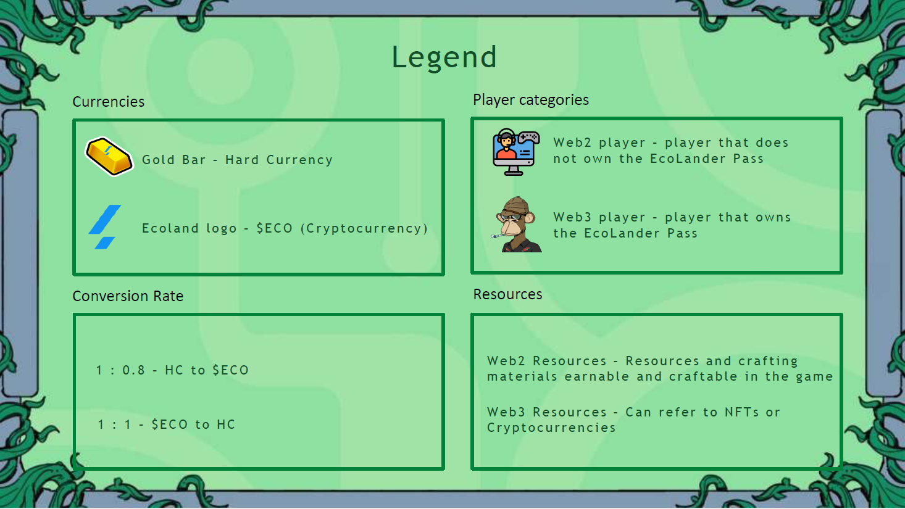

# 📚 Economy visualisation

<figure><figcaption>
Legend
</figcaption></figure>

***

<figure><figcaption>
Disclaimer
</figcaption></figure>

***

## Spending


A Web2 player, a freemium player, can purchase Hard Currency, a soft Web2 currency allowing them to purchase Bundles, Time Skips, use them in events, cosmetics and other sources, to enrich they experience and speed up their progression.



A Web3 player, identified by owning the EcoLander Pass, which enables access to blockchain features, can as well act as a Web2 player, having the optional choice of spending money to acquire cosmetics and other benefits, which are balanced to allow even non-payers to have an amazing experience.



A Web3 player can also choose to act as a Web3 players in the same time, acquiring the ECO token that can be used on the marketplace and on the purchase of specific Web3 features.



Last but not least, there is always a conversion between HC Hard Currency and the ECO token, allowing a person to buy the ECO token and convert it to HC or the other way around, at certain conversion rates.


<figure><figcaption>
What players can buy
</figcaption></figure>

***

## Earning


A Web2 player can use crafting materials earned at high levels to use them in the mine and earn Hard Currency. Therefore, you can experience a true freemium economy and have access to cosmetics and other valuable rewards that are acquired with Hard Currency just by playing.



An Web3 player can choose to act as a Web2 player and has full access to the freemium systems.



Moreover, a Web3 player can burn certain NFTs crafting materials, generated by NFTs inside the game, to mine the ECO token from the available tokens available in the pool dedicated to ECO tokens rewards.



Last but not least, as mentioned above as well, there is always a direct conversion between the HC and the token.


<figure><figcaption>
How players earn
</figcaption></figure>

Through rigurous game economy balancing, we ensure a stable economy that is rewarding for players and that can't fall in the trap of hugely inflationary economies that crash.
